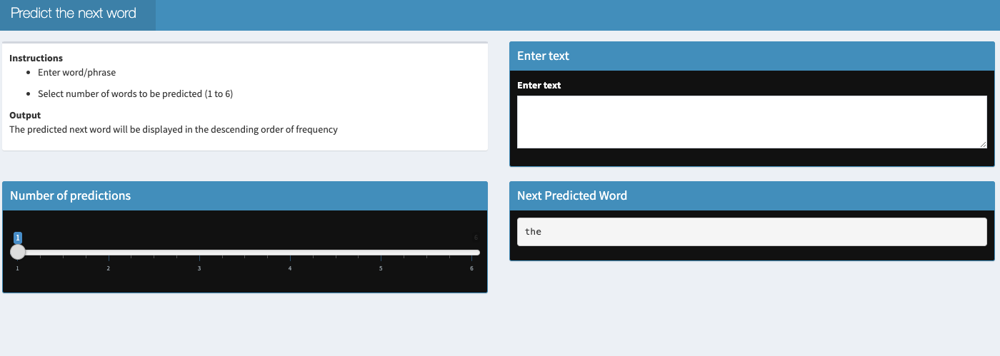

# SwiftKeyboard

This project was a part of the Capstone Project in the Data Science Specialization offered by Johns Hopkins University in [Coursera](https://www.coursera.org/specializations/jhu-data-science?). The dataset was carefully analyzed using the statistical properties and was applied to [Natural Language Processing](https://en.wikipedia.org/wiki/Natural_language_processing) in order to build a predictive text [application](https://shovitraj.shinyapps.io/ShinyWordPred/?_ga=2.33889057.1456873740.1639935672-449462300.1639935672). 

In this web based application user inputs text, as text is typed by the user, predictive model will recommend the next possible words(s) to be appended to the input stream. The text data was downloaded [here](https://d396qusza40orc.cloudfront.net/dsscapstone/dataset/Coursera-SwiftKey.zip) and is porvided in four different languages. English corpra was used for this application and the model was trained using document corpus compiled from the following three sources of text data:

* Blogs
* Twitter
* News

The large corpus of text documents were analyzed to discover the structure in the data and how words are put together to build a predictive model. 
N-Gram linguistic model was used to build a smart keyboard that predicts the next word based on input of the words. 

## Roadmap to the Model

* **Getting and cleaning the data:**
  * All the provided corpus was combined into one.
  * 25% of the corpus was selected for training a model
* Exploratory Data Analysis:
  * Frequency of words and their pairs were calculated
* Modeling:
  * Quanteda package was used to tokenize the corpus
  * 1 to 7-gram model was build for word prediction

## Algorithm and Prediction

* To improve efficiency, word pairs that appear less than 5 times in the corpus were removed    
* Katz's back-off model was used to predict the next word    
* The model iterates from 7-gram to 1-gram to find matches in the last (n-1) words
* It starts from 7-gram, backs off to 6-gram if there is no prediction. 
* It continues till, it back-off to 1-gram. 
* When the user input is null, the most frequent word 'the' is returned when number of prediction by default is 1

## The Shiny App

Here is a [link](https://shovitraj.shinyapps.io/ShinyWordPred/?_ga=2.198586543.1456873740.1639935672-449462300.1639935672) to the application which provides all the necessary instructions.
   

